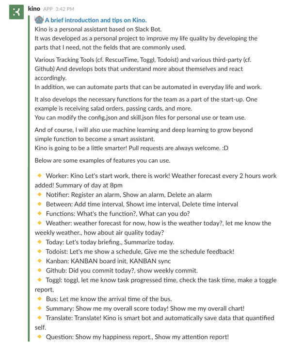
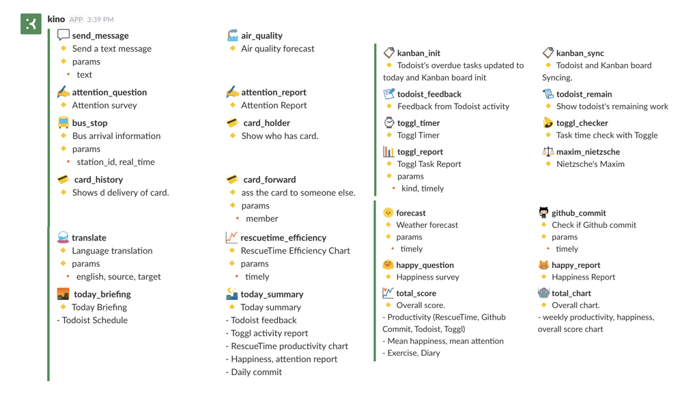

# Personal Assistant Kino Part 1 - Overview.

The Kino is a project to know about myself through [Quantified Self](http://quantifiedself.com/), automate things to repeat and improve the quality of life.

## Introduction

I recently read a lot of articles about Bot. And did [mini project using bot](http://humanbrain.in/2016/08/21/slack_bot_for_salady/). while developing a bot, I thought it was time to start a personal project that I wanted to make the most.

The project is to create a personal assistant bot. I have been thinking of it for myself. So i using [Toggl] (https://www.toggl.com/) for recording the time I spend and [RescueTime] (https://www.rescuetime.com/) for recording what programs i use and how productive i am.
Other than that, [Pebble Time] (https://www.pebble.com/) was also tracking the sleeping and sleeping time. (actually, It is not accurate.) And I was managing the To do list using [Todoist] (https://ko.todoist.com/). So, the record about me has been accumulated as digitized data.

I have thought that I want to make a bot that knows about me based on the data I have accumulated. Of course, most of the above services are providing APIs.

 

    
    
    
    

### Data Collection Plan
1. [Toggl](https://www.toggl.com/): Easy to track time. I often use it to keep track of my work by pressing the timer before the work starts and ending the timer when the work is done.
2. [RescueTime](https://www.rescuetime.com/): It is a productivity management tool that records the time of the apps used on the PC.
3. [Pebble](https://www.pebble.com/): Tracking gait and sleep time. Data looks like a system that is recorded in a smart watch ... but it seems difficult to use with api.
4. [Todoist](https://ko.todoist.com/): Online task and to-do list management app. Smartphone, PC, Web, etc .. We can using all because it provides various platforms.
5. Other apps to collect sleeping time, happiness, concentration, productivity data (if not, i'll make it)

## Bot Platform

Next, I decided the platform that provide a Bot api. Recently, [Telegram] (https://www.telegram.org/), [Facebook Messenger] (https://www.messenger.com/), [Line] (https://line.me/en/) and etc..  Many Messaing App companies have released Bot APIs, but there have been some aspects that are somewhat unfit for personal.

While I was searching about it, I noticed the personal Slack that I was using. [IFTTT] (https://www.ifttt.com/) was used to record information about various services on Slack and was used for personal notes and other information (For example github commit log). Slack Bot is also very simple to run with, just BOT_TOKEN, and has already been developed with Slack [Salady Bot] (http://humanbrain.in/2016/08/21/slack_bot_for_salady/)) I thought it would be more appropriate than other services.

 

      
    출처 : Slack
 

### Why Slack Bot?
1. Already i using the Slack for personal use.
2. Other apps need to be configured with Server and Webhook configuration tasks, but Slack can run only with Token.
3. have already developed Slack Bot.
4. I was already familiar with it for Team.
5. Integration of external services is easy to use.

## Chat Bot

 Chat Bot has become a big buzzword, and I have seen many articles about various bots. [Api.ai] (https://api.ai/), [wit.ai] (https://wit.ai/ ), Recently in Korea, [AMICA.ai] (http://amica.ai/), [fluenty.ai] (http://www.fluenty.ai/) and other frameworks, such as easy to create a chat bot And became a little more popular.

  When you use this Bot framework, you can see how the flow of Bot is approached. Most frameworks use the NLP engine to extract **intent**, **named entity**, **sentiment**, **domain**, and so on, . It is still a Short-term, that is, it is good to remember and handle things that have just been talked about, but in the case of Long-term older conversations, it is much harder to remember the conversation and keep on talking. So the above bot frameworks are also aimed to support long-term.

  So I think that bots are largely divided into three kinds of bots.

 1. **Basic Chatbot**: Bot is just one **UX**. It is the case that a fixed response is made according to the set input. Usually the input is processed by a normalization expression, which does not include NLP.
 2. **Smart Chatbot**: This is the NLP step. Extracts intent, named entity, sentiment, domain, etc., and processes the response accordingly. This includes the NLG where the Dialog manager identifies and manages the conversation, and generates a natural response.
 3. **A.I Chatbot**: Bot at this stage means strong artificial intelligence. I can not imagine what it will look like yet. I think that Deep Learning + Reinforce Learning is getting closer and moving towards this step little by little.

 Here is the goal of the bot I want to create first. **Smart Chabot**. But the problem is that I need some data.

 So it is common to start from Basic Chatbot and collect data. Then, after a certain amount of data is collected, it is possible to automate by using Imitation Learning which learns based on existing logic. After that, you can gather more data, and if you do, you can make it behave a bit smarter.

 I made a plan for such a long-term project and came up with what it needed in this process.
 First of all, I use it as a personal bot, so I do not have to say something complicated. Do minimal natural language processing and understand intent through simple keyword matching.
 Next, we will create functions using existing services without having to create whole functions.
 Finally, what I need is what bot can do at a given time.

I used to register various kinds of services as Kino's Skills and simply register my job with simple natural language processing so that Kino can do it at the time I want (for example, let me know the weather every 2 hours, ...) Below is an intermediate result of Kino so far.

Next, let's take a little more detail on Skill and Scheduling.

## Kino

My personal assistant Kino who started to do so. Below is the intermediate output.

 
 Intro & Guide

 
 Skills
