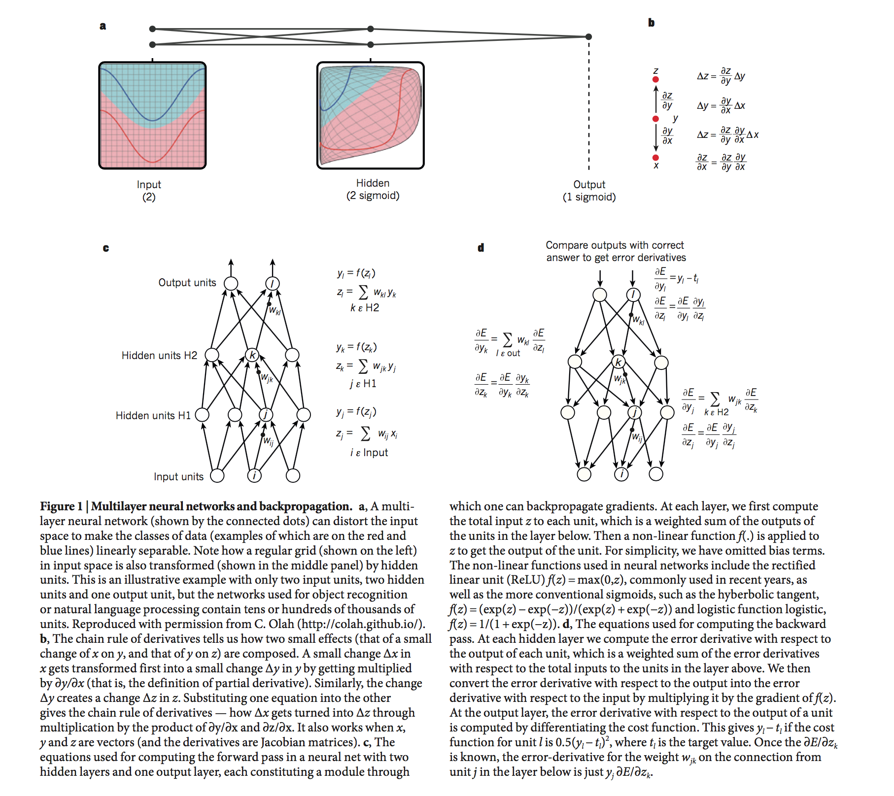
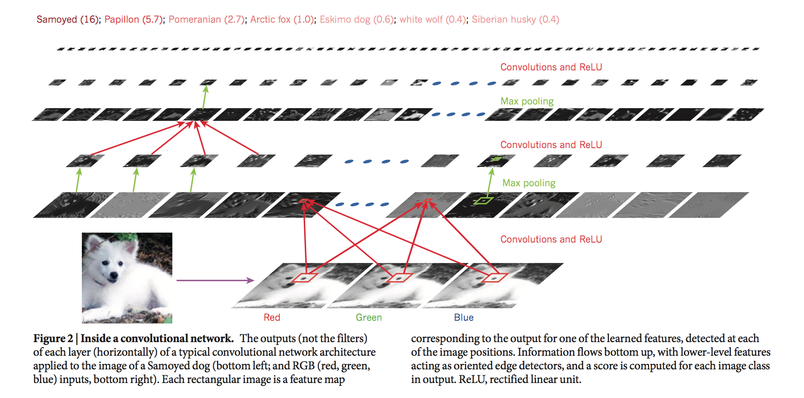
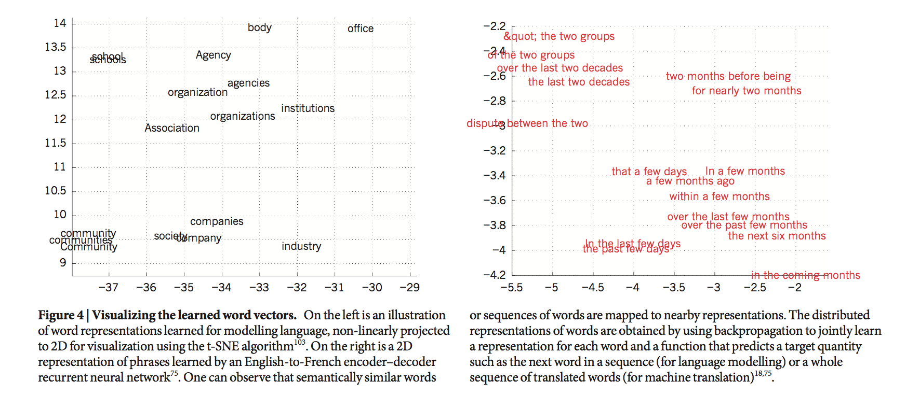
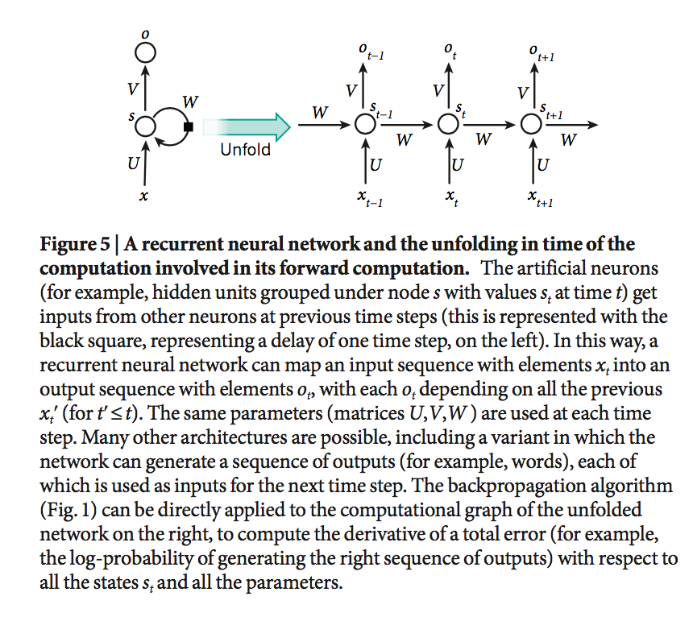
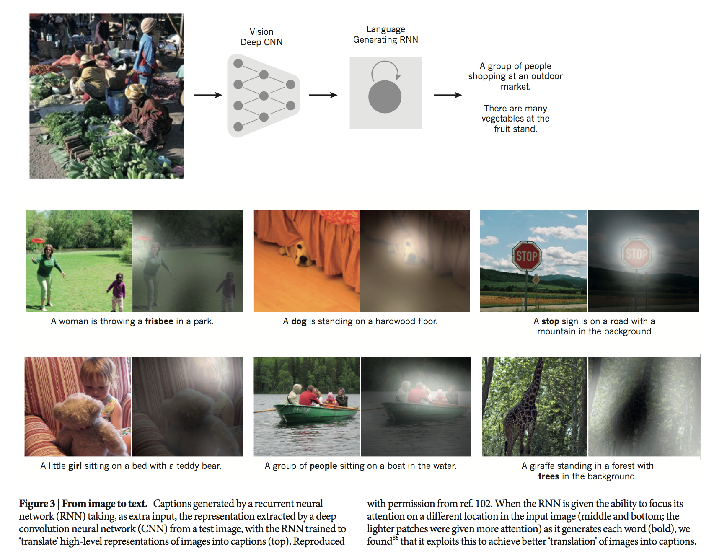

## Deep learning

Bengio, Yoshua, Ian J. Goodfellow, and Aaron Courville. "**Deep learning**." An MIT Press book. (2015). [[pdf]](https://github.com/HFTrader/DeepLearningBook/raw/master/DeepLearningBook.pdf) **(Deep Learning Bible, you can read this book while reading following papers.)** :star::star::star::star::star:

### Summary

> Deep learning allows computational models that are composed of multiple processing layers to learn representations of data with multiple levels of abstraction. Deep learning discovers intricate structure in large data sets by using the backpropagation algorithm to indicate how a machine should change its internal parameters that are used to compute the representation in each layer from the representation in the previous layer.

- Representation learning is a set of methods that allow a machine to be fed with raw data and to automatically discover the representations needed for detection or classification.

- The key aspect of deep learning is that these layers of features are not designed by human engineers; they are learned from data using a general-purpose learning procedure.

- objective function, stochastic graident descent(SGD), linear classifiers
	- In practice, poor local minima are rarely a problem with large networks.
	- Recent theoretical and empirical results strongly suggest that local minima are not a serious issue in general.

- convolution network (good feature extractor)
	- advantages : local connections, shared weights, pooling and the use of many layers
	- feature map - local groups of values are often highly correlated, the local statistics of images and other signals are invariant to location.
	- pooling - merge semantically similar feature into one

- pre-traininig, fine-tuned
	- unsupervised pre-training helps to prevent overfitting, leading to significantly better generalization when the number of labelled examples is small, or in a transfer setting where we have lots of examples for some 'source' tasks but very few for some 'target' tasks.

- distributed representations and language processing
	- counting frequencies of occurrences of short symbol seqeuences of length up N (called N-grams)

- recurrent neural network
	- For tasks that involve sequential inputs, such as speech and language
	- gradient expload or vanish problems
	- LSTM

- image captioning

- future of deep learning
	- expect unsupervised learning to become far more important in the longer term. Human and animal learning is largely unsupervised
	- expect much of the future progress in vision to come from systems that are trained end-to-end and combine ConvNets with RNNs that use reinforcement learning to decide where to look.
	- expect systems that use RNNs to understand sentences of whole documents will become much better when they learn strategies for selectively attending to one part at a time.

### Reading

### Video